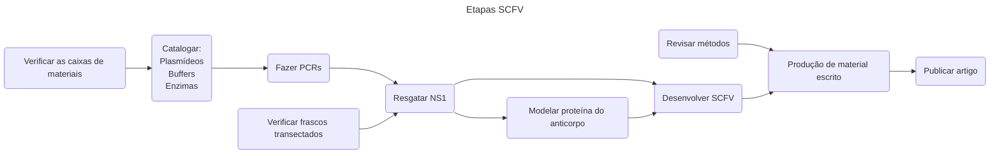

# Fluxo do Projeto NS1

```mermaid
---
title: Etapas SCFV
---
flowchart LR

caixas("Verificar as caixas de materiais")
caixas --> amostras
amostras("`Catalogar:
Plasmídeos
Buffers
Enzimas`")
pcr("Fazer PCRs")
amostras --> pcr --> resgate
frascos("Verificar frascos transectados")
resgate("Resgatar NS1")
frascos --> resgate --> scfv
métodos("Revisar métodos")
métodos --> material
material("Produção de material escrito")
biotech("Modelar proteína do anticorpo")
biotech --> scfv
resgate ---> biotech
scfv("Desenvolver SCFV")
publicar("Publicar artigo")
scfv --> material --> publicar
```
