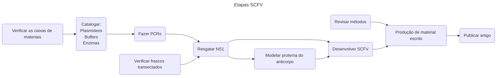

# Projeto NS1
Breve descrição do projeto.

## Seções do projeto:
- [Quadro de Gerenciamento](https://github.com/users/Neblinus/projects/6/views/1)
- [Tabela de Tarefas](https://github.com/users/Neblinus/projects/6/views/3?layout=table)
- [Tickets](https://github.com/Neblinus/LBTM/issues?q=is%3Aissue%20state%3Aopen%20project%3ANeblinus%2F6)

## Fluxo de planejamento:

